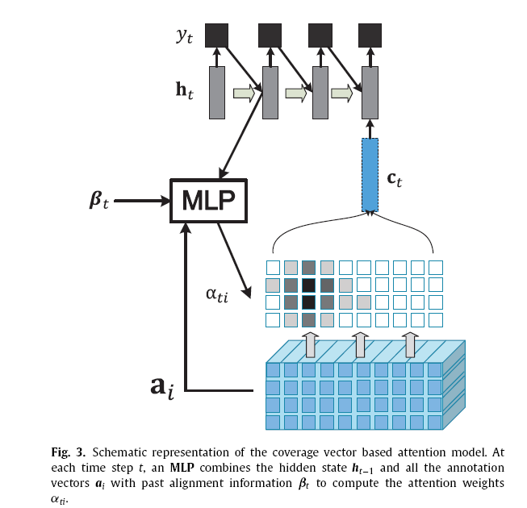
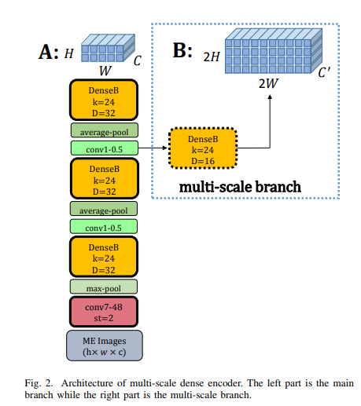
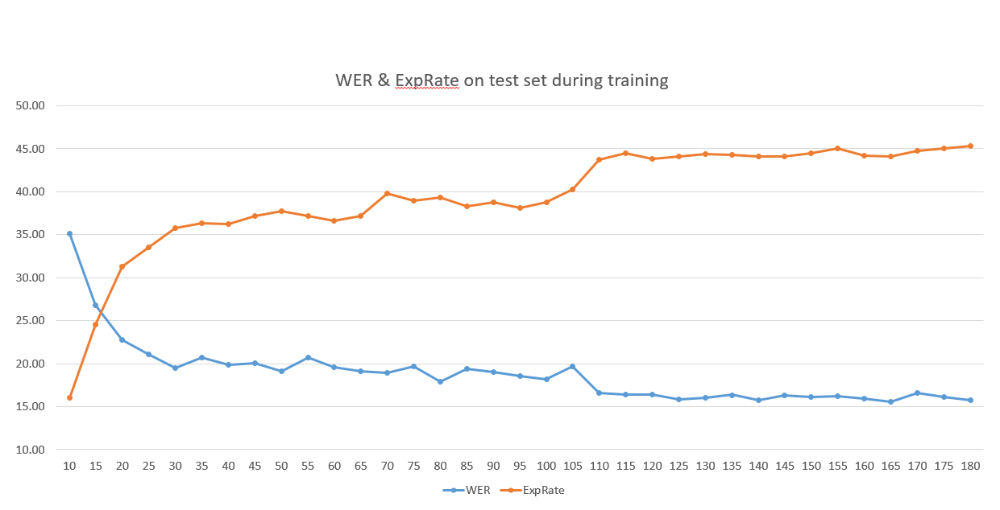

# Watch-Attend-and-Parse-tensorflow-version

This project is a tensorflow implementation of the DenseNet model provided by [jianshu's Github](https://github.com/JianshuZhang/WAP). Mainly based on his two papers,
[Watch, attend and parse: An end-to-end neural network based approach to handwritten mathematical expression recognition](https://www.sciencedirect.com/science/article/pii/S0031320317302376) and [Multi-Scale Attention with Dense Encoder for Handwritten Mathematical Expression Recognition](https://arxiv.org/abs/1801.03530).

In [jianshu's model](https://github.com/JianshuZhang/WAP/tree/master/DenseNet), the codes are in Theano, then I convert the codes into tensorflow version and the performance is comparative with jianshu's [best model](https://github.com/JianshuZhang/WAP/tree/master/DenseNet/models) provided in his github. The performance of the codes can achieve 44%-45% ExpRate on single Tesla K80 GPU. The final results reported in jianshu's papers are obtained after five models ensembling. And the performance reported on single model is almost 
the same as ours as jianshu stated in his github [issues](https://github.com/JianshuZhang/WAP/issues/7)

# Requirements

  - Tensorflow v1.6
  - Python 3
  - cuda 9.0 [optional]
  - cudnn 7 [optional]

# Validation result on offline-test.pkl

